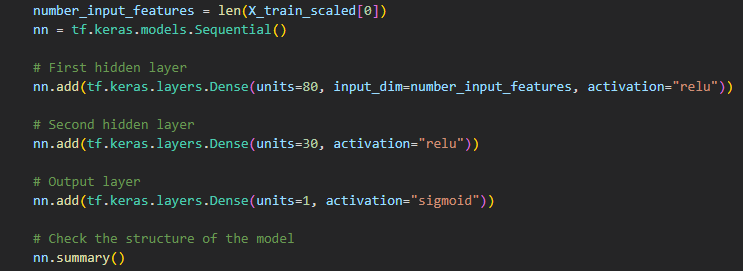
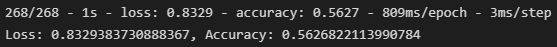
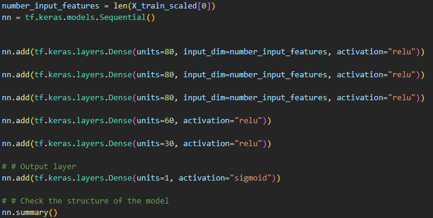
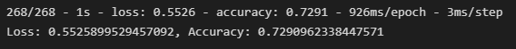

# Neural_Network_Charity_Analysis

## Overview

The purpose of this model is to determine whether business will be successful if funded by Alphabet soup.

### Results

The Is_Successful column is the column/variable that will be the target for this model while the other meta data will form the base for predictions.

The EIN and Name columns are dropped since they will not be factors in determining the success of the businesses. The following are considered features of the model.

    APPLICATION_TYPE            17
    AFFILIATION                  6
    CLASSIFICATION              71
    USE_CASE                     5
    ORGANIZATION                 4
    STATUS                       2
    INCOME_AMT                   9
    ASK_AMT                   8747

The features below may not be instramental in determining business success and can also be removed.

    SPECIAL_CONSIDERATIONS       2
    AFFILIATION                  6

## Compiling, Training and Evaluating

The original model used two hidden layers and an output layer. This resulted in a lower Accuracy of 0.56.

### Original Neural Network and Accuracy

### Improved Neural Network and Accuracy

To improve the accuracy score. More hidden layers were added with varying units.

## Summary
The improved neural network achieved 0.72 in accuracy falling short of the required 0.75. A supervised machine learning model using classification would have been better to predict the success of companies funded by Aplphabet Soup.

